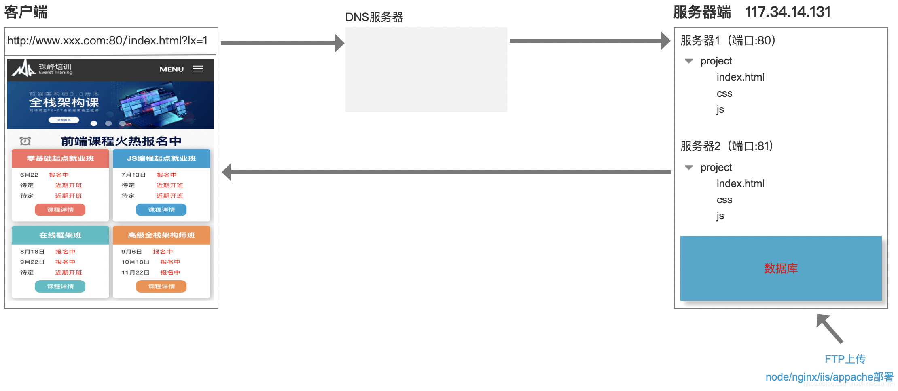
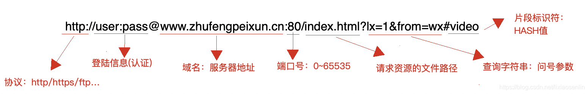
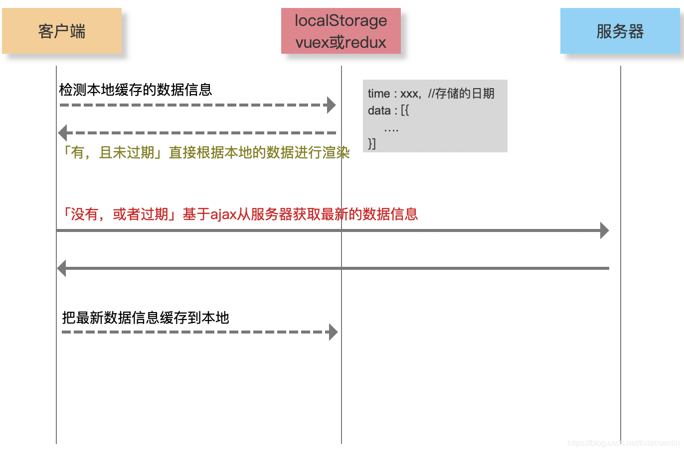
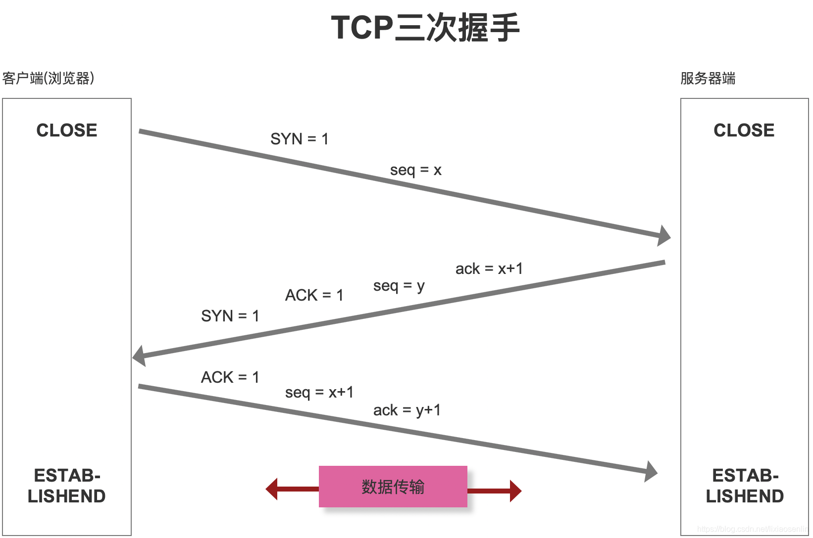
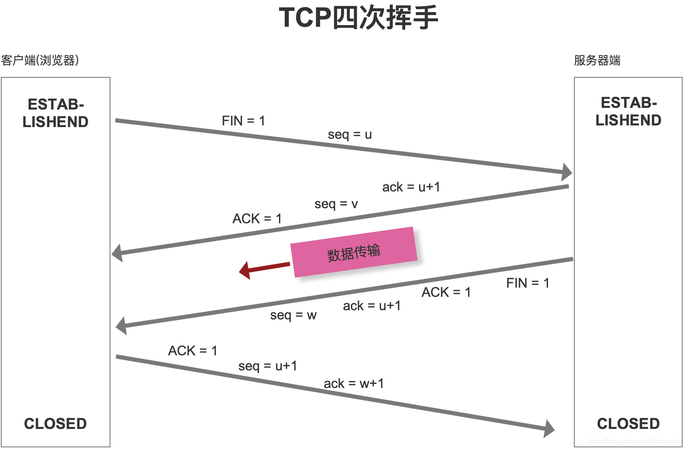

```
1、url解析：首先会判断输入的是一个合法 url还是关键词，并根据输入的内容进行相应的操作。
2、查找缓存：浏览器会判断所请求的资源是否在浏览器缓存中，以及是否失效。如果没有失效就直接使用；如果没有缓存或失效了，就继续下一步。
3、DNS解析：此时需要获取url中域名对应的IP地址。浏览器会依次查看浏览器缓存、操作系统缓存中是否有ip地址，如果缓存中没有就会向本地域名服务器发起请求，获取ip地址。本地域名服务器也会先检查缓存，有则直接返回；如果也没有，则采用迭代查询方式，向上级域名服务器查询。先向根域名服务器发起请求，获取顶级域名服务器的地址；再向顶级域名服务器发起请求以获取权限域名服务器地址；然后向权限域名服务器发起请求并得到url中域名对应的IP地址。
4、建立TCP连接：根据ip地址，三次握手与服务器建立TCP连接。
5、发起请求：浏览器向服务器发起HTTP请求。
6、响应请求：服务器响应HTTP请求，将相应的HTML文件返回给浏览器。
7、关闭TCP连接：四次挥手关闭TCP连接。
8、渲染页面：浏览器解析HTML内容，并开始渲染。浏览器渲染过程如下：
  构建DOM树：词法分析然后解析成DOM树，DOM树是由DOM元素及属性节点组成，树的根是document对象。
  构建CSS规则树：生成CSS 规则树。
  构建渲染树：将DOM树和CSS规则树结合，构建出渲染树。
  布局：计算每个节点的位置。
  绘制：使用浏览器的UI接口进行绘制。

```

##### 彻底掌握基于 HTTP 网络层的 “前端性能优化”

> 产品性能优化方案
> HTTP 网络层优化
> 代码编译层优化 webpack
> 代码运行层优化 html/css javascript vue react
> 安全优化 xss + csrf
> 数据埋点及性能监控
> …

##### 从输入 URL 地址到看到页面，中间都经历了啥



- 第一步：URL 解析

  > - 地址解析
  >   
  > - 编码：中文字符特殊字符等

- 第二步：缓存检查

  > - 缓存位置
  >   - Memory Cache 内存缓存
  >   - Disk Cache 硬盘缓存
  > - 缓存检查机制
  >   - 打开网页：查找 disk cache 中是否有匹配，如果有则使用，没有则发送网络请求
  >   - 普通刷新（F5）：因 TAB 页没有关闭，因此 memory cache 是可用的，会被优先使用，其次才是 disk cache
  >   - 强制刷新（ctrl+F5）：浏览器不使用缓存，因此发送的请求头部均带有 Cache-control：no-cache，服务器直接返回 200 和最新内容
  > - 缓存类型
  >
  >   - 强缓存 Expires / Cache-Control
  >   - 浏览器对于强缓存处理：根据第一次请求资源时返回的响应头来确定
  >   - Expires：缓存过期时间，用来指定资源的到期时间（HTTP1.0）
  >   - Cache-Control：cache-control: max-age=2592000 第一次拿到资源后的 2592000 秒内（30 天），再次发送请求时会直接读取缓存中的信息（HTTP1.1）
  >   - 两者同时存在的话，Cache-Control 的优先级高于 Expires
  >     
  >
  > - 协商缓存 Last-Modified / ETag
  >
  >   - 协商缓存就是强制缓存失效后，浏览器携带缓存标识向服务器发起请求，由服务器根据缓存标识决定是否使用缓存的过程
  >   - 客户端第一次请求数据时，服务器会分配一个缓存标识给客户端，当客户端再次请求服务器时需要携带该缓存标识一起发送给服务器，服务器根据资源文件是否有更新来返回相应内容：如果没更新，返回 304 通知客户端读取缓存信息，如果有更新则返回 200 及最新资源信息，以及新的缓存标识 Last-Modified / ETag
  >     
  >
  > - 数据缓存：数据缓存是手动设置的，在 js 中有个 localStorage/sessionStorage 可以用来保存数据到本地，当下次请求时可以直接从这里获取数据
  >   

- 第三步：DNS 解析
  > - DNS 解析就是浏览器在请求数据前，会先将域名信息发送给域名解析服务器，由域名解析服务器根据域名解析出该域名所对应的真实服务器的 IP 地址并返回给客户端，然后客户端再根据拿到的 IP 地址向真实的服务器发送请求
  > - 每次 DNS 解析时间大约在 20~120 毫秒
  > - DNS 解析过程一般分为两种：迭代查询和递归查询
  >
  >   - 递归查询： 在解析前会优先查看有没有缓存，如果有缓存则直接读取缓存数据，没有则再查看本地 hosts 文件，本地 DNS 解析缓存，如果都没有最后再到本地 DNS 服务器
  >   - 迭代查询：则是优先解析根域名然后是等级域名然后是权威域名
  >     
  >
  > - DNS 解析优化
  >   - 减少 DNS 请求次数
  >   - DNS 与解析（DNS Prefetch）：浏览器渲染的同时进行域名解析
  >   - 分服务器部署
  >     - 资源合理利用
  >     - 抗压能力加强
  >     - 提高 HTTP 并发

```
<meta http-equiv="x-dns-prefetch-control" content="on">
<link rel="dns-prefetch" href="//static.360buyimg.com"/>
<link rel="dns-prefetch" href="//misc.360buyimg.com"/>
<link rel="dns-prefetch" href="//img10.360buyimg.com"/>
<link rel="dns-prefetch" href="//d.3.cn"/>
<link rel="dns-prefetch" href="//d.jd.com"/>
```

- 第四步：TCP 三次握手

  > - seq 序号，用来标识从 TCP 源端项目的端发送的字节流，发起方发送数据时对此进行标记
  > - ack 确认号，只有 ACK 标志位为 1 时，确认序号才有效，ack=seq+1
  > - 标志位：
  >   - ACK：确认序号有效
  >   - RST：重置连接
  >   - SYN：发起一个新连接
  >   - FIN：释放一个连接
  >     
  >
  > 三次握手为什么不用两次或四次？
  >
  > - TCP 作为一种可靠传输控制协议，其核心思想：既要保证数据可靠传输，又要提高传输效率
  > - 如果是两次那么会导致服务器发送消息给客户端，客户端没有回应则服务器无法确定客户端是否有收到消息
  > - 如果是四次则多了一次就没有必要了

- 第五步：数据传输

  > HTTP 报文
  >
  > - 请求报文
  > - 响应报文
  > - 响应状态码
  >   - 200 OK 返回成功
  >   - 202 Accepted ：服务器已接受请求，但尚未处理（异步）
  >   - 204 No Content：服务器成功处理了请求，但不需要返回任何实体内容
  >   - 206 Partial Content：服务器已经成功处理了部分 GET 请求（断点续传 Range/If-Range/Content-Range/Content-Type:”multipart/byteranges”/Content-Length….）
  >   - 301 Moved Permanently
  >   - 302 Move Temporarily
  >   - 304 Not Modified
  >   - 305 Use Proxy
  >   - 400 Bad Request : 请求参数有误
  >   - 401 Unauthorized：权限（Authorization）
  >   - 404 Not Found
  >   - 405 Method Not Allowed
  >   - 408 Request Timeout
  >   - 500 Internal Server Error
  >   - 503 Service Unavailable
  >   - 505 HTTP Version Not Supported

- 第六步：TCP 四次挥手
  

> - 为什么连接的时候是三次握手，关闭的时候却是四次挥手？
>   - 服务器端收到客户端的 SYN 连接请求报文后，可以直接发送 SYN+ACK 报文
>   - 但关闭连接时，当服务器端收到 FIN 报文时，很可能并不会立即关闭链接，所以只能先回复一个 ACK 报文，告诉客户端：”你发的 FIN 报文我收到了”，只有等到服务器端所有的报文都发送完了，我才能发送 FIN 报文，因此不能一起发送，故需要四步握手。

- 第七步：页面渲染
  [web 前端高级 - 浏览器底层渲染机制及性能优化](https://blog.csdn.net/lixiaosenlin/article/details/110244147)

#### 性能优化汇总

> 利用缓存
> 1、对于静态资源文件实现强缓存和协商缓存（扩展：文件有更新，要保证及时刷新）
> 2、对于不经常更新的接口数据采用本地存储做数据缓存（cookie、localStorage、vuex、redux 等）
>
> DNS 优化
> 1、分服务器部署，增加 HTTP 并发性
> 2、DNS 预解析（DNS Prefetch）

> TCP 的三次握手和四次挥手
> 1、Connection：keep-alive

> 数据传输
> 1、减少数据传输的大小
>
> - 内容或者数据压缩（webpack 等）
> - 服务器端开启 GZIP 压缩（一般能压缩 60%左右）
> - 大批量数据分批次请求（如：下拉刷新或分页，保证首次加载请求数据少）
>   2、减少 HTTP 请求次数
>
> - 资源文件合并处理
> - 使用字体图标
> - 雪碧图（精灵图）CSS-Sprit
> - 图片 BASE64
> - CDN 服务（地域分布式）
>
> 采用 HTTP2.0
>
> - 网络优化是前端性能优化中的重点内容，因为大部分的消耗都是发生在网络层，尤其是第一次页面加载，如何减少等待时间很重要（减少白屏的效果和时间）
>
>   - LOADING 人性化体验
>   - 骨架屏（客户端+服务器端）
>   - 图片延迟加载

#### HTTP1.0 和 HTTP1.1 及 HTTP2.0 的区别

> - HTTP1.0 和 HTTP1.1 的区别
>   - 缓存处理：HTTP1.0 中主要使用 Last_Mdified、Expires 来作为缓存判断的标准，HTTP1.1 则引入了更多的缓存控制策略：ETag 和 Cache_control
>   - 带宽优化及网络连接的使用：HTTP1.1 支持断点续传，返回码是 206（Partial Content）
>   - 错误通知管理：在 HTTP1.1 中新增了 24 个错误状态码， 如 409（Conflict）表示请求的资源与资源的当前状态发生冲突；410（Gone）表示服务器上的资源被永久性的删除
>   - Host 头处理：在 HTTP1.0 中认为每台服务器都绑定一个唯一的 IP 地址，因此请求消息中的 URL 并没有传递主机名（hostname）。但随着虚拟主机技术的发展，在一台物理服务器上可以存在多个虚拟主机（Multi-homed Web Servers），并且它们共享一个 IP 地址。HTTP1.1 的请求消息和响应消息都支持 Host 头域，且请求信息中如果没有 Host 头域会报一个错误（400 Bad Request）
>   - 长连接： HTTP1.1 中默认开启 Connection：keep-alive，一定程度上弥补了 HTTP1.0 每次请求都要创建连接的缺点
> - HTTP2.0 和 HTTP1.x 相比的一些新特性
>   - 新的二进制格式（Binary Format），HTTP1.x 的解析是基于文本，基于文本协议的格式解析存在天然缺陷，文本的表现形式有多样性，要做的健壮性考虑的场景必然很多；二进制则不同，只认 0 和 1 的组合，基于这种考虑 HTTP2.0 的协议解析决定采用二进制格式，实现方便且健壮
>   - header 压缩：HTTP1.x 的 header 带有大量信息，且每次都要重复发送，HTTP2.0 使用 encoder 来减少需要传输的 header 的大小，通讯双方各自 cache 一份 header field 表，既避免了重复 header 的传输，又减小了需要传输的大小
>   - 服务端推送：例如：在网页上有一个 style.css 的请求，在客户端收到 style.css 数据的同时，服务端会将 style.js 的文件也推送给客户端，当客户端再次尝试获取 style.js 时就可以直接从缓存中获取到，不再发送请求
>   - 多路复用（MultiPlexing）
>     - HTTP1.0 ：每次请求响应，建立一个 TCP 连接，用完关闭
>     - HTTP1.1 ：采用长连接（Connection:keep-alive），若干个请求排队串行化单线程处理，后面的请求等待前面的请求返回才能获得执行机会，一旦有某请求超时，后面的请求只能被阻塞，也就是常说的线头阻塞
>     - HTTP2.0：多路复用，多个请求同时在一个连接上并行执行，某个请求任务耗时严重，不会影响其他连接的正常执行
