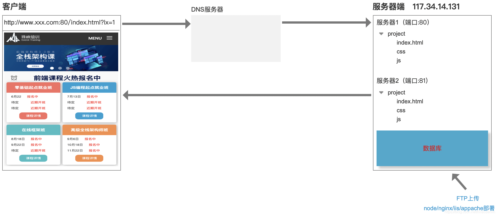
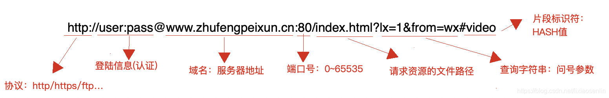
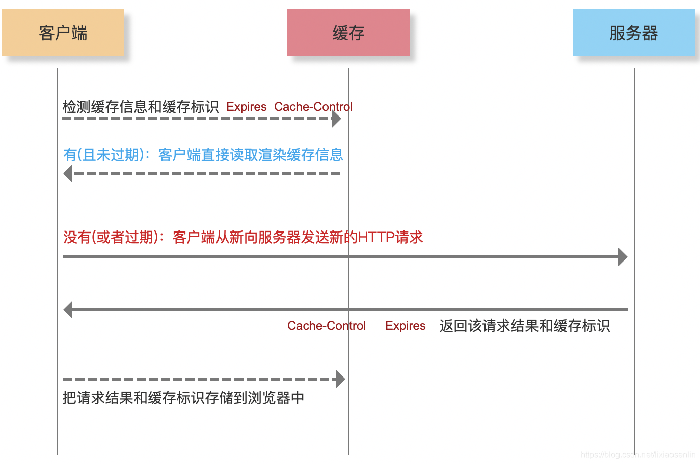
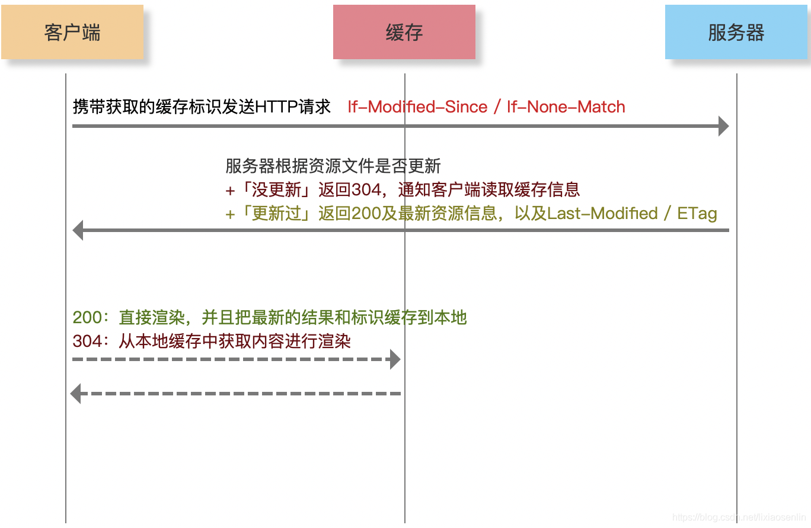
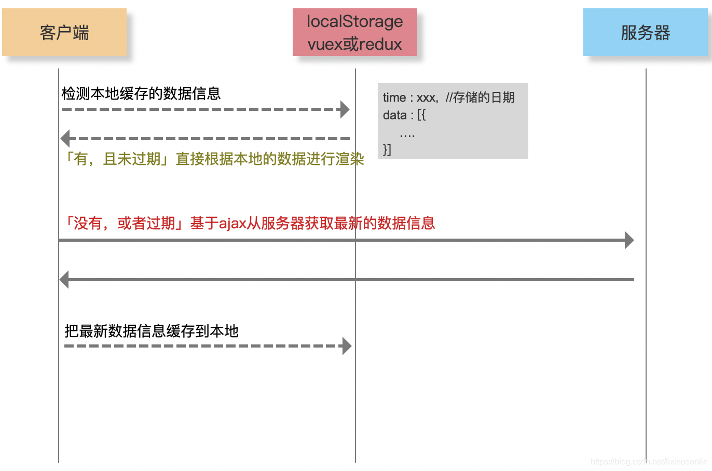
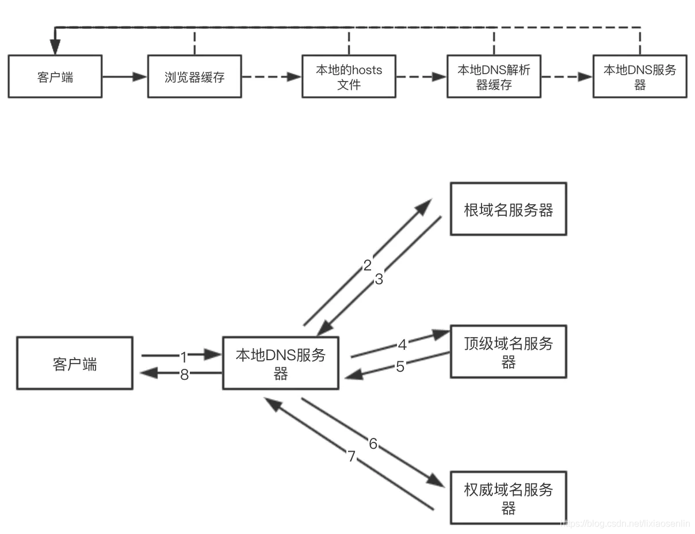
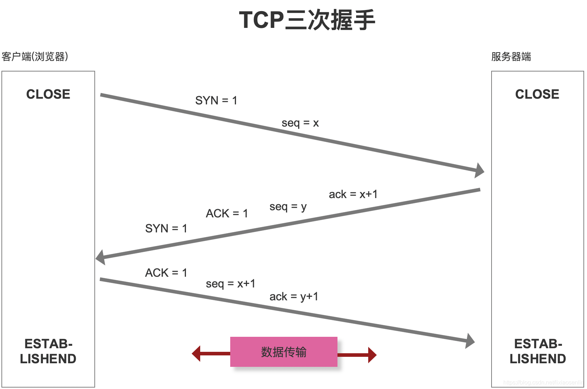
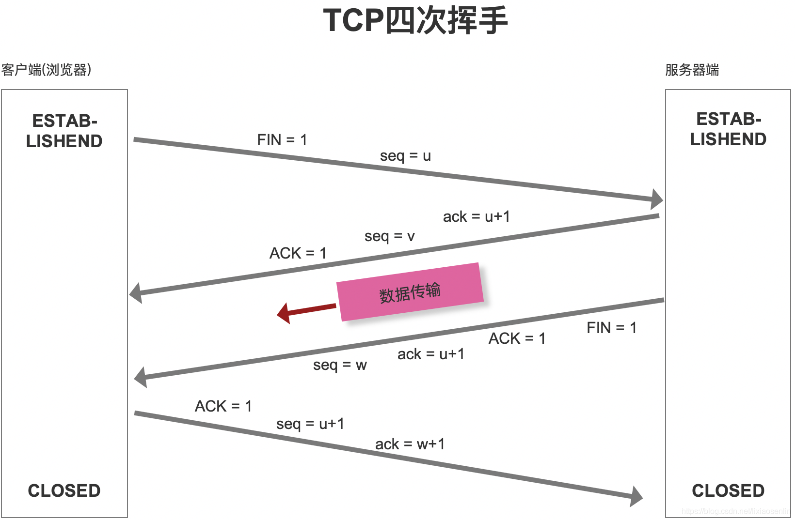

```
1. DNS协议 域名=>ip地址
2. 建立TCP链接，发请求
3. 后端接受请求，读文件，读数据库，获取完了端口，返回数据
4. 前端接收html渲染页面
1. html=> dom tree
2. css=>css tree
3. dom + css tree => rending tree
4. 渲染页面
5. 执行js
```

##### 彻底掌握基于HTTP网络层的 “前端性能优化”
> 产品性能优化方案
> HTTP网络层优化
> 代码编译层优化 webpack
> 代码运行层优化 html/css javascript vue react
> 安全优化xss + csrf
> 数据埋点及性能监控
> …

##### 从输入URL地址到看到页面，中间都经历了啥


* 第一步：URL解析
> * 地址解析

> * 编码：中文字符特殊字符等

* 第二步：缓存检查
> * 缓存位置
>   * Memory Cache 内存缓存
>   * Disk Cache 硬盘缓存
> * 缓存检查机制
>   * 打开网页：查找disk cache中是否有匹配，如果有则使用，没有则发送网络请求
>   * 普通刷新（F5）：因TAB页没有关闭，因此memory cache是可用的，会被优先使用，其次才是disk cache
>   * 强制刷新（ctrl+F5）：浏览器不使用缓存，因此发送的请求头部均带有Cache-control：no-cache，服务器直接返回200和最新内容
> * 缓存类型
>   * 强缓存 Expires / Cache-Control
>   * 浏览器对于强缓存处理：根据第一次请求资源时返回的响应头来确定
>   * Expires：缓存过期时间，用来指定资源的到期时间（HTTP1.0）
>   * Cache-Control：cache-control: max-age=2592000第一次拿到资源后的2592000秒内（30天），再次发送请求时会直接读取缓存中的信息（HTTP1.1）
>   * 两者同时存在的话，Cache-Control的优先级高于Expires

> 
> * 协商缓存Last-Modified / ETag
>   * 协商缓存就是强制缓存失效后，浏览器携带缓存标识向服务器发起请求，由服务器根据缓存标识决定是否使用缓存的过程
>   * 客户端第一次请求数据时，服务器会分配一个缓存标识给客户端，当客户端再次请求服务器时需要携带该缓存标识一起发送给服务器，服务器根据资源文件是否有更新来返回相应内容：如果没更新，返回304通知客户端读取缓存信息，如果有更新则返回200及最新资源信息，以及新的缓存标识Last-Modified / ETag

>
> * 数据缓存：数据缓存是手动设置的，在js中有个localStorage/sessionStorage可以用来保存数据到本地，当下次请求时可以直接从这里获取数据


* 第三步：DNS解析
> * DNS解析就是浏览器在请求数据前，会先将域名信息发送给域名解析服务器，由域名解析服务器根据域名解析出该域名所对应的真实服务器的IP地址并返回给客户端，然后客户端再根据拿到的IP地址向真实的服务器发送请求
> * 每次DNS解析时间大约在20~120毫秒
> * DNS解析过程一般分为两种：迭代查询和递归查询
>   * 递归查询： 在解析前会优先查看有没有缓存，如果有缓存则直接读取缓存数据，没有则再查看本地hosts文件，本地DNS解析缓存，如果都没有最后再到本地DNS服务器
>   * 迭代查询：则是优先解析根域名然后是等级域名然后是权威域名

> 
> * DNS解析优化
>   * 减少DNS请求次数
>   * DNS与解析（DNS Prefetch）：浏览器渲染的同时进行域名解析
>   * 分服务器部署
>     * 资源合理利用
>     * 抗压能力加强
>     * 提高HTTP并发

```
<meta http-equiv="x-dns-prefetch-control" content="on">
<link rel="dns-prefetch" href="//static.360buyimg.com"/>
<link rel="dns-prefetch" href="//misc.360buyimg.com"/>
<link rel="dns-prefetch" href="//img10.360buyimg.com"/>
<link rel="dns-prefetch" href="//d.3.cn"/>
<link rel="dns-prefetch" href="//d.jd.com"/>
```
* 第四步：TCP三次握手
> * seq序号，用来标识从TCP源端项目的端发送的字节流，发起方发送数据时对此进行标记
> * ack确认号，只有ACK标志位为1时，确认序号才有效，ack=seq+1
> * 标志位：
>   * ACK：确认序号有效
>   * RST：重置连接
>   * SYN：发起一个新连接
>   * FIN：释放一个连接

>
> 三次握手为什么不用两次或四次？
>
> * TCP作为一种可靠传输控制协议，其核心思想：既要保证数据可靠传输，又要提高传输效率
> * 如果是两次那么会导致服务器发送消息给客户端，客户端没有回应则服务器无法确定客户端是否有收到消息
> * 如果是四次则多了一次就没有必要了

* 第五步：数据传输
> HTTP 报文
> * 请求报文
> * 响应报文
> * 响应状态码
>   * 200 OK返回成功
>   * 202 Accepted ：服务器已接受请求，但尚未处理（异步）
>   * 204 No Content：服务器成功处理了请求，但不需要返回任何实体内容
>   * 206 Partial Content：服务器已经成功处理了部分 GET 请求（断点续传 Range/If-Range/Content-Range/Content-Type:”multipart/byteranges”/Content-Length….）
>   * 301 Moved Permanently
>   * 302 Move Temporarily
>   * 304 Not Modified
>   * 305 Use Proxy
>   * 400 Bad Request : 请求参数有误
>   * 401 Unauthorized：权限（Authorization）
>   * 404 Not Found
>   * 405 Method Not Allowed
>   * 408 Request Timeout
>   * 500 Internal Server Error
>   * 503 Service Unavailable
>   * 505 HTTP Version Not Supported

* 第六步：TCP四次挥手


> * 为什么连接的时候是三次握手，关闭的时候却是四次挥手？
>   * 服务器端收到客户端的SYN连接请求报文后，可以直接发送SYN+ACK报文
>   * 但关闭连接时，当服务器端收到FIN报文时，很可能并不会立即关闭链接，所以只能先回复一个ACK报文，告诉客户端：”你发的FIN报文我收到了”，只有等到服务器端所有的报文都发送完了，我才能发送FIN报文，因此不能一起发送，故需要四步握手。

* 第七步：页面渲染
[web前端高级 - 浏览器底层渲染机制及性能优化](https://blog.csdn.net/lixiaosenlin/article/details/110244147)

#### 性能优化汇总
> 利用缓存
> 1、对于静态资源文件实现强缓存和协商缓存（扩展：文件有更新，要保证及时刷新）
> 2、对于不经常更新的接口数据采用本地存储做数据缓存（cookie、localStorage、vuex、redux等）
> 
> DNS优化
> 1、分服务器部署，增加HTTP并发性
> 2、DNS预解析（DNS Prefetch）

> TCP的三次握手和四次挥手
> 1、Connection：keep-alive

> 数据传输
> 1、减少数据传输的大小
>   * 内容或者数据压缩（webpack等）
>   * 服务器端开启GZIP压缩（一般能压缩60%左右）
>   * 大批量数据分批次请求（如：下拉刷新或分页，保证首次加载请求数据少）
> 2、减少HTTP请求次数
> 
>   * 资源文件合并处理
>   * 使用字体图标
>   * 雪碧图（精灵图）CSS-Sprit
>   * 图片BASE64
> * CDN服务（地域分布式）
> 
> 采用HTTP2.0
> 
> * 网络优化是前端性能优化中的重点内容，因为大部分的消耗都是发生在网络层，尤其是第一次页面加载，如何减少等待时间很重要（减少白屏的效果和时间）
>
>   * LOADING人性化体验
>   * 骨架屏（客户端+服务器端）
>   * 图片延迟加载

#### HTTP1.0 和HTTP1.1及HTTP2.0的区别
> * HTTP1.0 和 HTTP1.1的区别
>   * 缓存处理：HTTP1.0中主要使用Last_Mdified、Expires来作为缓存判断的标准，HTTP1.1则引入了更多的缓存控制策略：ETag和Cache_control
>   * 带宽优化及网络连接的使用：HTTP1.1支持断点续传，返回码是206（Partial Content）
>   * 错误通知管理：在HTTP1.1中新增了24个错误状态码， 如409（Conflict）表示请求的资源与资源的当前状态发生冲突；410（Gone）表示服务器上的资源被永久性的删除
>   * Host头处理：在HTTP1.0中认为每台服务器都绑定一个唯一的IP地址，因此请求消息中的URL并没有传递主机名（hostname）。但随着虚拟主机技术的发展，在一台物理服务器上可以存在多个虚拟主机（Multi-homed Web Servers），并且它们共享一个IP地址。HTTP1.1的请求消息和响应消息都支持Host头域，且请求信息中如果没有Host头域会报一个错误（400 Bad Request）
>   * 长连接： HTTP1.1中默认开启Connection：keep-alive，一定程度上弥补了HTTP1.0每次请求都要创建连接的缺点
> * HTTP2.0和HTTP1.x相比的一些新特性
>   * 新的二进制格式（Binary Format），HTTP1.x的解析是基于文本，基于文本协议的格式解析存在天然缺陷，文本的表现形式有多样性，要做的健壮性考虑的场景必然很多；二进制则不同，只认0和1的组合，基于这种考虑HTTP2.0的协议解析决定采用二进制格式，实现方便且健壮
>   * header压缩：HTTP1.x的header带有大量信息，且每次都要重复发送，HTTP2.0使用encoder来减少需要传输的header的大小，通讯双方各自cache一份header field表，既避免了重复header的传输，又减小了需要传输的大小
>   * 服务端推送：例如：在网页上有一个style.css的请求，在客户端收到style.css数据的同时，服务端会将style.js的文件也推送给客户端，当客户端再次尝试获取style.js时就可以直接从缓存中获取到，不再发送请求
>   * 多路复用（MultiPlexing）
>     * HTTP1.0 ：每次请求响应，建立一个TCP连接，用完关闭
>     * HTTP1.1 ：采用长连接（Connection:keep-alive），若干个请求排队串行化单线程处理，后面的请求等待前面的请求返回才能获得执行机会，一旦有某请求超时，后面的请求只能被阻塞，也就是常说的线头阻塞
>     * HTTP2.0：多路复用，多个请求同时在一个连接上并行执行，某个请求任务耗时严重，不会影响其他连接的正常执行