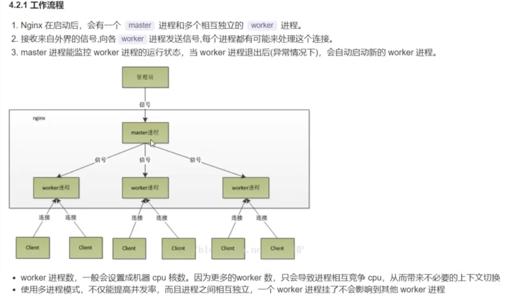
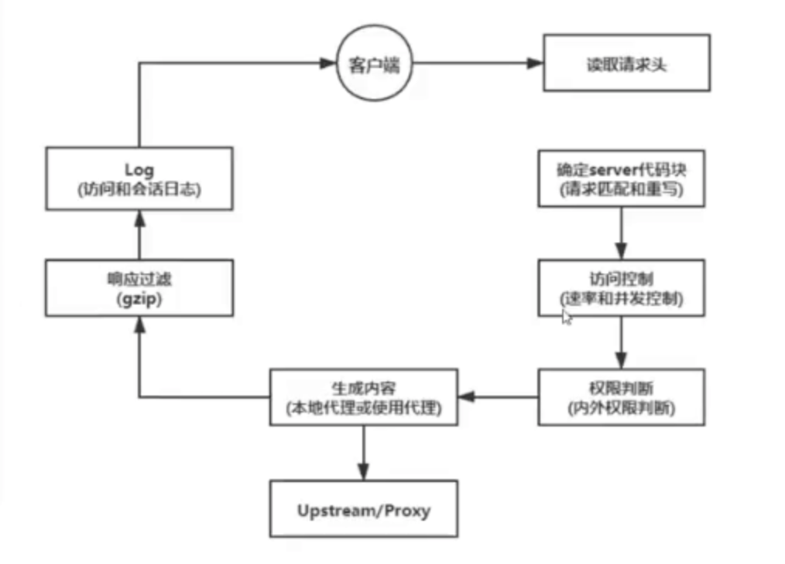
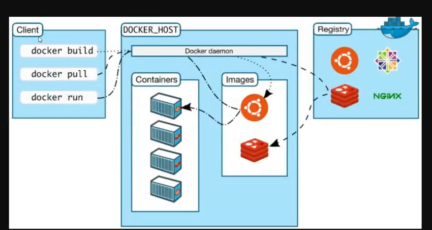

# 前端运维知识点


1.linux

2.nginx

3.docker

4.jenkins

5.k8s


强调注重实用性，很多知识不需要深入了解，知道干啥，会用即可。


#### 目标成果：

1.搭建一套自动构建发布流程，实现本地代码推送到git仓库后，服务器完成自动构建与部署功能，完毕后直接访问。

2.在步骤1基础上实现后端功能，并部署一套服务集群，实现负载均衡等功能。


达成目标技能分解：

目标1： 学习linux nginx docker jenkins git等基础知识，掌握必要的服务器操作知识。ci,cd部分对jenkins使用较为频繁。

目标2：需掌握一点的后端知识，打算使用node去做。数据库集成mysql,radis,mongodb，k8s实现集群部署。


学习背景：

前端领域深度拓展越来越费力，付出成本越来越高。与之相比宽度领域却还是一片蓝海，稍微付出即可大把收货。
未来的不确定性加剧，可独力完成一整套小型项目流程的技能与能力，可以最大保障不确定的下限。


起航
# 一.linux
### 1. 版本
各个厂商会制作自己的发行版本

redhat
CentOS
ubuntu
fedora
### 2. Linux与Windows的不同
Linux严格区分大小写
Linux中所有的内容以文件形式保存，包括硬件、用户和文件。
Linux不靠扩展名区分文件类型，是靠权限来区分，但是有一些约定的扩展名，是给管理员看的
压缩包 gzb22 tar．bz2tgz
二进制文件pm
网页文件 html.php
脚本文件sh
配置文件 conf
Windows下的程序不能直接在Linux中安装和运行
Linux更多使用字符界面
占用的系统资源更少
减少了出错和被攻击的可能性，会让系统更稳定


### 3. Linux系统的文件结构
/bin 二进制文件，系统常规命令
/boot 系统启动分区，系统启动时读取的文件
/dev 设备文件
/etc 大多数配置文件
/home 普通用户的家目录
/lib 32位函数库
/lib64 64位库
/media 手动临时挂载点
/mnt 手动临时挂载点
/opt 第三方软件安装位置
/proc 进程信息及硬件信息
/root 临时设备的默认挂载点
/sbin 系统管理命令
/srv 数据
/var 数据
/sys 内核相关信息
/tmp 临时文件
/usr 用户相关设定
### 4. Linux系统命令行的含义
示例：root@app00:~#
root //用户名，root为超级用户
@ //分隔符
app00 //主机名称
~ //当前所在目录，默认用户目录为~，会随着目录切换而变化，例如：（root@app00:/bin# ，当前位置在bin目录下）
#### //表示当前用户是超级用户，普通用户为$，例如：（"yao@app00:/root$" ，表示使用用户"yao"访问/root文件夹）

### 5.常用命令
https://blog.csdn.net/ds_Yang/article/details/102695726


# 二.nginx
### 1.nginx应用场景
静态资源服务器
反向代理服务
API接口服务（Lua＆Javascript）


反向代理： 把结果返回给客户端,，客户端根本不知道这个代理的存在，即是反向代理。

如虚拟主机，一个服务可以部署多个项目 多个域名http-proxy， a.zf.cn -→网站 b.zf.cn -＞网站 80服务器 ＝＞ 3000

正向代理： 如果代理服务器是帮助客户端的，就是正向代理。如VPN。webpack proxy


>安装  yum install -y nginx


### 2.相关文件夹
https://juejin.cn/post/6844904144235413512


主要关注的文件夹有两个：
 /etc/nginx/conf.d/ 文件夹，是我们进行子配置的配置项存放处，    /etc/nginx/nginx.conf 主配置文件会默认把这个文件夹中所有子配置项都引入；
 /usr/share/nginx/html/ 文件夹，通常静态文件都放在这个文件夹，也可以根据你自己的习惯放其他地方；
### 3.Nginx 操作常用命令
Nginx 的命令在控制台中输入 nginx -h 就可以看到完整的命令，这里列举几个常用的命令：

```
nginx -s reload  # 向主进程发送信号，重新加载配置文件，热重启
nginx -s reopen	 # 重启 Nginx
nginx -s stop    # 快速关闭
nginx -s quit    # 等待工作进程处理完成后关闭
nginx -T         # 查看当前 Nginx 最终的配置
nginx -t -c <配置路径>    # 检查配置是否有问题，如果已经在配置目录，则不需要-c
```


systemctl 是 Linux 系统应用管理工具 systemd 的主命令，用于管理系统，我们也可以用它来对 Nginx 进行管理，相关命令如下：

```
systemctl start nginx    # 启动 Nginx
systemctl stop nginx     # 停止 Nginx
systemctl restart nginx  # 重启 Nginx
systemctl reload nginx   # 重新加载 Nginx，用于修改配置后
systemctl enable nginx   # 设置开机启动 Nginx
systemctl disable nginx  # 关闭开机启动 Nginx
systemctl status nginx   # 查看 Nginx 运行状态
```


### 4. 典型配置
Nginx 的典型配置：


```
user  nginx;                        # 运行用户，默认即是nginx，可以不进行设置
worker_processes  1;                # Nginx 进程数，一般设置为和 CPU 核数一样
error_log  /var/log/nginx/error.log warn;   # Nginx 的错误日志存放目录
pid        /var/run/nginx.pid;      # Nginx 服务启动时的 pid 存放位置

events {
    use epoll;     # 使用epoll的I/O模型(如果你不知道Nginx该使用哪种轮询方法，会自动选择一个最适合你操作系统的)
    worker_connections 1024;   # 每个进程允许最大并发数
}

http {   # 配置使用最频繁的部分，代理、缓存、日志定义等绝大多数功能和第三方模块的配置都在这里设置
    # 设置日志模式
    log_format  main  '$remote_addr - $remote_user [$time_local] "$request" '
                      '$status $body_bytes_sent "$http_referer" '
                      '"$http_user_agent" "$http_x_forwarded_for"';

    access_log  /var/log/nginx/access.log  main;   # Nginx访问日志存放位置

    sendfile            on;   # 开启高效传输模式
    tcp_nopush          on;   # 减少网络报文段的数量
    tcp_nodelay         on;
    keepalive_timeout   65;   # 保持连接的时间，也叫超时时间，单位秒
    types_hash_max_size 2048;

    include             /etc/nginx/mime.types;      # 文件扩展名与类型映射表
    default_type        application/octet-stream;   # 默认文件类型

    include /etc/nginx/conf.d/*.conf;   # 加载子配置项
    
    server {
    	listen       80;       # 配置监听的端口
    	server_name  localhost;    # 配置的域名
    	
    	location / {
    		root   /usr/share/nginx/html;  # 网站根目录
    		index  index.html;   # 默认首页文件
    		deny 172.168.22.11;   # 禁止访问的ip地址，可以为all
    		allow 172.168.33.44； # 允许访问的ip地址，可以为all
    	}
    	
    	error_page 500 502 503 504 /50x.html;  # 默认50x对应的访问页面
    	error_page 400 404 error.html;   # 同上
    }
}
```


server 块可以包含多个 location 块，location 指令用于匹配 uri，语法：


```
location [ = | ~ | ~* | ^~] uri {
	...
}
```


指令后面：

= 精确匹配路径，用于不含正则表达式的 uri 前，如果匹配成功，不再进行后续的查找；
^~ 用于不含正则表达式的 uri； 前，表示如果该符号后面的字符是最佳匹配，采用该规则，不再进行后续的查找；
~ 表示用该符号后面的正则去匹配路径，区分大小写；
~* 表示用该符号后面的正则去匹配路径，不区分大小写。跟
~ 优先级都比较低，如有多个location的正则能匹配的话，则使用正则表达式最长的那个；


架构：nginx采用的是多进程(单线程)和多路IO复用模型







# ★ 三. docker
https://juejin.cn/post/6844903618097725453


### 1. Docker简介
- Docker 属于 Linux 容器的一种封装，提供简单易用的容器使用接口。它是目前最流行的 Linux 容器解决方案Docker 将应用程席与该程序的依赖，打包在一个文件里面。运行这文件，就会生成一个虚拟容器。程序在这个虚拟容器里运行，就好像在真实的物理机上运行一样
- Docker 是一个开源的应用容器引擎，基于 Go 语言 并遵从 Apache2.0 协议开源。
- Docker 可以让开发者打包他们的应用以及依赖包到一个轻量级、可移植的容器中，然后发布到任何流行的 Linux 机器上，也可以实现虚拟化。
容器是完全使用沙箱机制，相互之间不会有任何接口（类似 iPhone 的 app）更重要的是容器性能开销极低


### 2. docker应用场景
节省项目环境部署时间
单项目打包
整套项目打包
新开源技术
环境一致性
持续集成
微服务S
弹性伸缩

### 3.Docker 体系结构
containerd 是一个守护进程，使用runc管理容器，向Docker Engine提供接口
shim 只负责管理一个容器
runC是一个轻量级工具，只用来运行容器





总结： docker是一个软件。 镜像是一个系统光盘，容易就是安装好的一个个系统,互相隔离。


docker命令 总结
https://www.jianshu.com/p/e3b92b79985e

```
docker container --help

# 下载jboss/wildfly镜像
docker image pull jboss/wildfly
# 删除镜像 
docker rmi [imageName]
# 以交互模式启动一个新的wildfly容器
docker container run -it jboss/wildfly
# 以交互模式启动一个新的openjdk容器
docker container run -it openjdk:12
# 后台模式
docker container run -d jboss/wildfly
# 查看正在运行的容器
docker container ls
# 给容器设置自定义名称
docker container run -d --name mywildfly jboss/wildfly
# 查看容器的日志
docker container logs mywildfly
# 对外映射到随机端口
docker container run -d -P jboss/wildfly
# 对外映射到指定端口
docker container run -d --name wildfly-custom-port -p 38888:8080 jboss/wildfly
# 停止容器
docker container stop CONTAINER-ID
docker container stop CONTAINER-NAME
# 停止多个容器
docker container stop mywildfly wildfly-custom-port
# 停止所有的容器
docker container stop $(docker container ls -q)
# 启动容器
docker container start CONTAINER-ID
docker container start CONTAINER-NAME
# 启动多个容器
docker container start mywildfly wildfly-custom-port
# 交互模式启动容器
docker container start -ai mywildfly
# 查看端口映射
docker container port CONTAINER-ID
docker container port CONTAINER-NAME
# 停止并删除多个容器
docker container stop mywildfly wildfly-custom-port
docker container rm mywildfly wildfly-custom-port
# 删除所有已经停止的容器
docker container prune
# 进入运行容器
docker container exec -it CONTAINER-ID /bin/bash
```


# 四.jenkins
### 1.CI/CD
CI 的意思是 持续构建。负责拉取代码库中的代码后，执行用户预置定义好的操作脚本，通过一系列编译操作构建出一个制品，并将制品推送至到制品库里面。常用工具有 Gitlab Cl，Github Cl，Jenkins 等。这个环节不参与部署，只负责构建代码，然后保存构建物.构建物被称为 制品，保存制品的地方被称为制品库。


CD 则有2层含义: 持续部署 (Continuous Deployment) 和持续交付 (Continuous Delivery) 。

持续交付 的概念是:将制品库的制品拿出后，部署在测试环境/交付给客户提前测试。 持续部署 则是将制品部署在生产环境。


### 2. Jenkins的特征：
开源的Java语言开发持续集成工具，支持持续集成，持续部署。
易于安装部署配置：可通过yum安装,或下载war包以及通过docker容器等快速实现安装部署，可方便web界面配置管理。
消息通知及测试报告：集成RSS/E-mail通过RSS发布构建结果或当构建完成时通过e-mail通知，生成JUnit/TestNG测试报告。名称
分布式构建：支持Jenkins能够让多台计算机一起构建/测试。
文件识别：Jenkins能够跟踪哪次构建生成哪些jar，哪次构建使用哪个版本的jar等。
丰富的插件支持：支持扩展插件，你可以开发适合自己团队使用的工具，如git，svn，maven，docker等。


- 1）首先，开发人员每天进行代码提交，提交到Git仓库

- 2）然后，Jenkins作为持续集成工具，使用Git工具到Git仓库拉取代码到集成服务器，再配合JDK，

Maven等软件完成代码编译，代码测试与审查，测试，打包等工作，在这个过程中每一步出错，都重新

再执行一次整个流程。

- 3）最后，Jenkins把生成的jar或war包分发到测试服务器或者生产服务器，测试人员或用户就可以访问

应用。


# 五.K8S
https://juejin.cn/post/6952331691524358174


### 1.什么是 Kubernetes
Kubernetes 看作是用来是一个部署镜像的平台
可以用来操作多台机器调度部署镜像
在 Kubenetes 中，可以使用集群来组织服务器的。集群中会存在一个 Master 节点，该节点是 Kubernetes 集群的控制节点，负责调度集群中其他服务器的资源。其他节点被称为 Node


虽然 Docker 已经很强大了，但是在实际使用上还是有诸多不便，比如集群管理、资源调度、文件管理等等。那么在这样一个百花齐放的容器时代涌现出 了很多解决方案，比如 Mesos、Swarm、Kubernetes 等等，其中谷歌开源的 Kubernetes 是作为老大哥的存在。

kubernetes 已经成为容器编排领域的王者，它是基于容器的集群编排引擎，具备扩展集群、滚动升级回滚、弹性伸缩、自动治愈、服务发现等多种特性能力


Kubernetes 解决的核心问题
- 服务发现和负载均衡
Kubernetes 可以使用 DNS 名称或自己的 IP 地址公开容器，如果到容器的流量很大，Kubernetes 可以负载均衡并分配网络流量，从而使部署稳定。
存储编排
Kubernetes 允许您自动挂载您选择的存储系统，例如本地存储、公共云提供商等。
- 自动部署和回滚
您可以使用 Kubernetes 描述已部署容器的所需状态，它可以以受控的速率将实际状态更改为所需状态。例如，您可以自动化 Kubernetes 来为您的部署创建新容器，删除现有容器并将它们的所有资源用于新容器。
- 自动二进制打包
Kubernetes 允许您指定每个容器所需 CPU 和内存（RAM）。当容器指定了资源请求时，Kubernetes 可以做出更好的决策来管理容器的资源。
- 自我修复
Kubernetes 重新启动失败的容器、替换容器、杀死不响应用户定义的运行状况检查的容器，并且在准备好服务之前不将其通告给客户端。
- 密钥与配置管理
Kubernetes 允许您存储和管理敏感信息，例如密码、OAuth 令牌和 ssh 密钥。您可以在不重建容器镜像的情况下部署和更新密钥和应用程序配置，也无需在堆栈配置中暴露密钥。
Kubernetes 的出现不仅主宰了容器编排的市场，更改变了过去的运维方式，不仅将开发与运维之间边界变得更加模糊，而且让 DevOps 这一角色变得更加清晰，每一个软件工程师都可以通过 Kubernetes 来定义服务之间的拓扑关系、线上的节点个数、资源使用量并且能够快速实现水平扩容、蓝绿部署等在过去复杂的运维操作。


ps： jenkins构建配置步骤简介


1.检查服务器端口开启情况，可以先全部开启


2. 服务器端安装git, docker

3.安装 java,    yum install -y java-11-openjdk // 我安装的是11版本

4. https://pkg.origin.jenkins.io/redhat/ 按照官网步骤安装jenkins

5.systemctl start jenkins // 启动jenkins

6.默认8080端口进入jenkins页面， 系统管理=> 插件管理，先装好 nodejs, git 等必须插件。装好以后必须重启jenkins。

7.进入系统管理=> 全局工具配置 设置一个node。


8. 进入系统管理=>凭据=>新增一个凭据（可以选是ssh还是http连接）

自己去配置对应仓库的凭证

9.新建一个jenkins任务流，部分配置如下


执行sheel脚本

```
docker build -t react-test .
docker container run -d -p 3000:3000(映射端口号)  react-test:latest
```
10. 如果构建时没有权限，需要更改docker权限

```
groupadd docker  #新增docker用户组
gpasswd -a jenkins docker   #将当前用户添加至docker用户组
newgrp docker  #更新docker用户组
```

11. 然后点击构建部署完成后再对应端口即可访问部署项目

